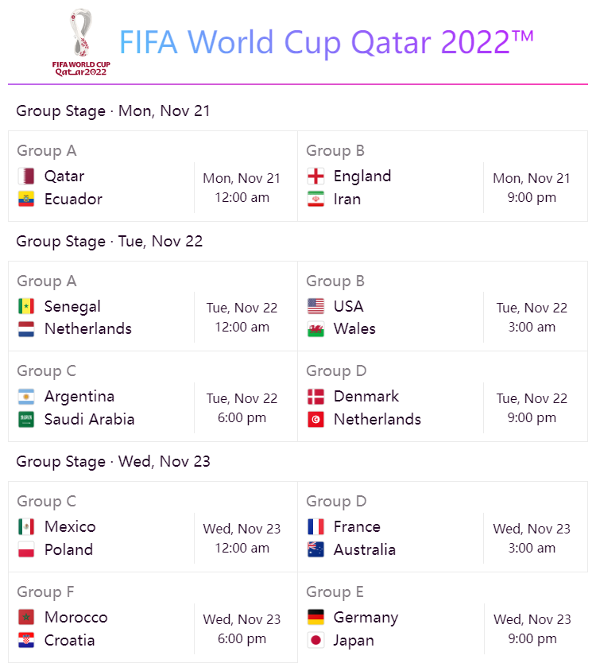
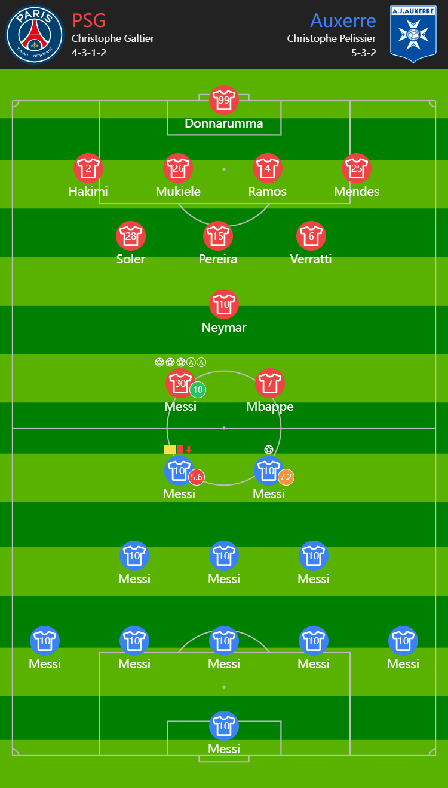
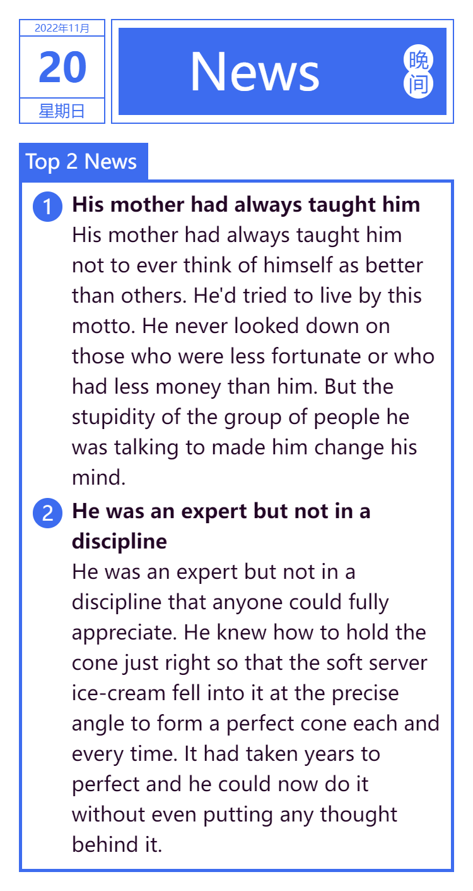
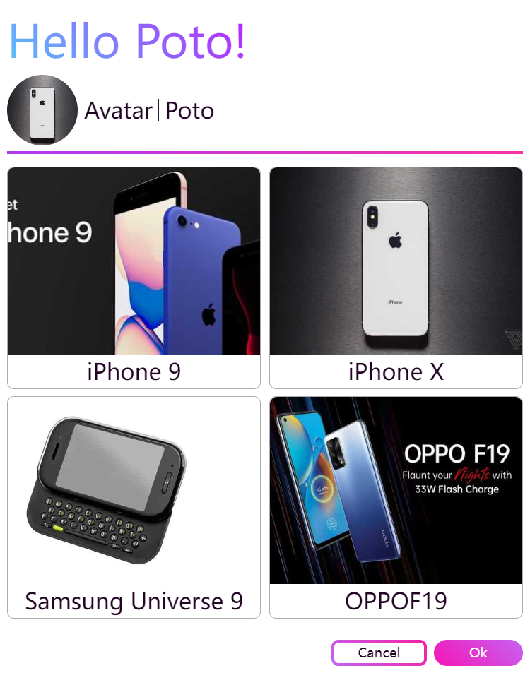

<h1 align="center">
Poto
</h1>

An open-source low-code Platform for Designers.
 Make design simple.
 

## Features

- 📋 Templates for tutorials
- 📽 `Record` and `Replay` the process of creating template
- 💾 Reusable custom blocks
- 🏞 Export to image
- 🧩 Custom plugins
- 🛠 Use data from REST API or JavaScript snippet
- 🟧 Built-in themes

Designed by [Poto](https://poto-vue.vercel.app/)

